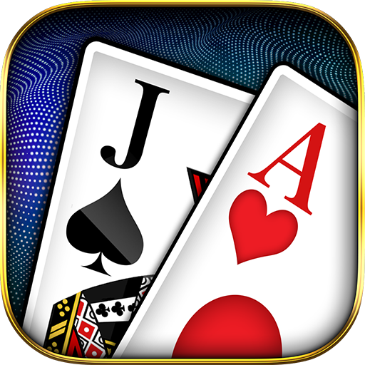

# 21 BlackJack VainillaJS

Este proyecto inició como un desafío planteado como parte de un Curso de JS en Udemy. No obstante, hoy retomo este mini-proyecto como parte de mi participación en Alura One Education Program G7 para llevar más allá mis conocimientos y completar la idea inicial. 

Espero sirva de demostración de las habilidades que he adquirido previamente. Cualquier comentario es bienvenido.

## Sobre El Autor

Empecé a aprender sobre programación desde los 13 años. Posteriormente a mis 20 años me enamoré de mi carrera como Administrador de Empresas (BBA).
No obstante, la vida y sus misteriosos caminos me han empujado a retomar lo que dejé en pausa y que volví a disfrutar. Espero continuar en mi camino y mejorar tanto como sea posible día con día.  

### Contactame
 - :e-mail: [!LinkedIn](https://www.linkedin.com/in/danespino91/?locale=en_US)
 - :briefcase: [!Portfolio Under Construction](https://danespino.github.io/)